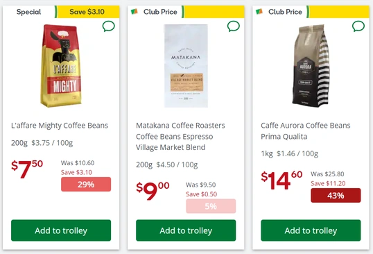

# CountdownNZ Savings Indicator

A userscript to find the best savings at [Countdown.co.nz](https://www.countdown.co.nz/).

Shows the percentage saved for items on sale, with a visual invidator for how good the discount is (deeper red means deeper savings). The invidator will show alongside the price in both product lists/searches and product details pages.

## Installation

This requires a a browser extension to run userscripts. Recommended options are:

- [Violentmonkey](https://violentmonkey.github.io/)
- [Tampermonkey](https://tampermonkey.net/)
- [Greasemonkey](https://www.greasespot.net/)

Once you have an extension installed, you can install the script by opening:

- <https://raw.githubusercontent.com/Unfocused/CountdownNZ-Savings/main/countdownnz-savings-indicator.user.js>
